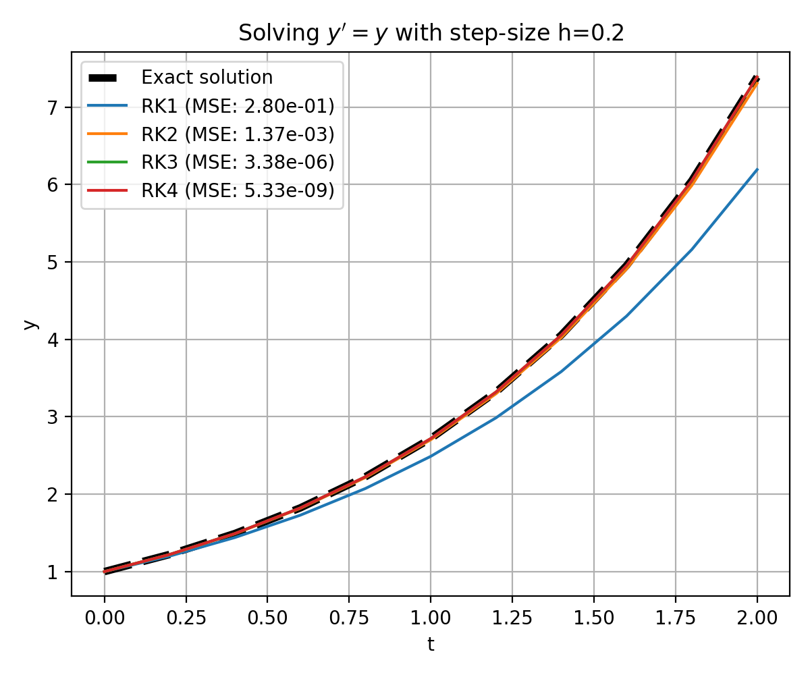

# Runge-Kutta methods

This repository contains the code for the blog post on [Runge-Kutta methods for solving ODEs](https://www.fabriziomusacchio.com/blog/2020-10-03-runge_kutta/). For further details, please refer to this post.



For reproducibility:

```powershell
conda create -n rungekutta -y python=3.9
conda activate rungekutta
conda install mamba -y
mamba install -y numpy matplotlib scikit-learn ipykernel
```
